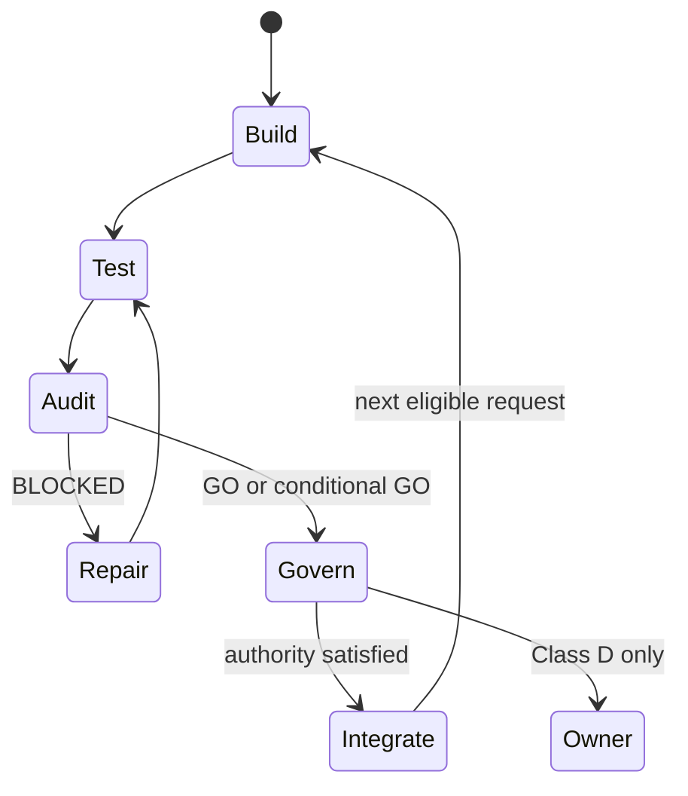

*Concept paper and single-project case study · **Version 0.1** · July 2026*

## Abstract

LLM agents can write code, run tests, edit documents, and operate tools. The hard problem is no longer getting an agent to act. It is preserving intent, limiting authority, checking the work, recovering from failure, and continuing for long enough to finish a real project.

This paper describes a council layer: a persistent, policy-governed execution system in which one agent builds, another audits, deterministic machinery verifies evidence, and a typed state machine decides what may happen next. Every important transition is bound to an immutable request, repository, commit, policy version, test observation, and structured verdict. Routine work continues automatically. Difficult judgment is routed to a frozen council procedure. Only actions that the system cannot legitimately take on behalf of its owner are returned to the owner.

The design grew out of the Agent Coliseum council protocol. A supplied 3,903-line council log records 116 structured audit requests and 115 completed structured verdicts: 38 `GO`, 14 `GO_WITH_CONDITIONS`, and 63 `BLOCKED`, with one request still in flight at the end of the snapshot. The blocks include replay-destroying evidence overwrite, identity collisions, mutable-request authorization bypasses, conditional-integration bypasses, retry-authority laundering, world-fork collisions, and governance-classification forgery paths. This is meaningful evidence that the protocol catches consequential defects before integration. It is not yet evidence of complete correctness, superior cost efficiency, or general effectiveness across projects.

The central claim is modest but useful:

> An LLM should not be trusted because it says the work is complete. A transition should be trusted only when the system can reconstruct why it was allowed.

## The core idea

Most agent workflows are conversations wrapped around tools:

```text
human asks -> agent edits -> tests pass -> agent says done
```

This works for small tasks. It breaks down over long projects because the conversation is doing too many jobs at once. It contains the idea, the plan, the authority, the status, the evidence, the review, and the memory of what happened. When the session ends, much of that structure disappears or has to be reconstructed.

The council pattern pulls those jobs out of the conversation and turns them into durable artifacts:

```text
intent -> bounded request -> exact implementation -> independent audit
       -> policy decision -> integration -> next eligible request
```

The agent still reasons in language, but language does not directly authorize important state changes. The execution layer checks typed events, hashes, commits, policies, permissions, and evidence before allowing the workflow to advance.

This is to execution what a persistent LLM-maintained wiki is to knowledge. Karpathy's [LLM Wiki](https://gist.github.com/karpathy/442a6bf555914893e9891c11519de94f) pattern argues that knowledge becomes more useful when synthesis is compiled into a maintained artifact instead of being rediscovered from raw documents on every query. The council applies the same compounding logic to work:

| Persistent knowledge system | Persistent execution system |
| --- | --- |
| Raw sources | Ideas, requirements, policies, and evidence |
| Maintained wiki | Governed work graph and implementation |
| Schema file | Constitution, event schemas, and authority policy |
| Ingest | Convert intent into a bounded request |
| Lint | Audit, replay, adversarial checks, and policy evaluation |
| Append-only activity log | Hash-linked execution ledger |
| Compounding synthesis | Compounding implementation and regression knowledge |

The important shift is from chat history to project memory, and then from project memory to enforceable project state.

## What the council layer is

The council is not another coding agent. It is the transaction and governance layer around coding agents.

An agent framework answers:

> What should the model do next?

The council layer answers:

> What evidence must exist before the system is allowed to say that the next state has been reached?

Its closest software analogues are a combination of:

- a workflow state machine;
- continuous integration;
- protected code review;
- an append-only audit ledger;
- software-supply-chain provenance;
- capability-based authorization;
- and a constitutional governance process.

This is consistent with prior work showing that agent performance depends heavily on the interface around the model, not just the model itself. The [SWE-agent paper](https://arxiv.org/abs/2405.15793) treats the agent-computer interface as a first-class design object. The council extends that insight from tool usability to authority, provenance, and long-horizon control.

## Architecture

There are six layers.

### 1. Intent sources

Ideas begin as documents, conversations, issue descriptions, research plans, or specifications. They are preserved as sources rather than treated as executable authority.

An intent source may say, "build persistent world forks," but it cannot directly authorize new code, a live experiment, a policy change, or external publication.

### 2. The constitution

The constitution defines:

- roles;
- allowed event types;
- protected paths;
- prohibited capabilities;
- evidence requirements;
- policy versions;
- retry limits;
- integration rules;
- emergency stops;
- and the narrow actions reserved for the owner.

The constitution is versioned and activated separately from its implementation. New governance code can be built and audited while inert. It becomes effective only when an authenticated policy transition binds the exact policy version and implementation.

This resembles the high-level motivation of [Constitutional AI](https://arxiv.org/abs/2212.08073): explicit principles can move some supervision from repeated human judgments into a reusable rule system. The council applies that idea to execution-time governance rather than model training.

### 3. The work compiler

The builder converts an idea into a dependency-ordered graph of bounded requests. Each request freezes the relevant scope:

- request identifier;
- target repository;
- target commit;
- task kind;
- allowed and prohibited actions;
- expected tests;
- configuration hashes;
- policy pin;
- evidence inputs;
- and integration conditions.

The request is a transaction proposal. Builder-written prose may describe it, but prose is not trusted for security boundaries. Actual changed paths, commit identity, and hashes are derived independently.

### 4. The executor

The builder implements one bounded slice, runs tests, commits the result, and publishes an audit request. Execution remains inside a configured envelope of time, storage, tools, paths, and external effects.

The executor is not authorized to approve its own work. It can propose, repair, and integrate only after the relevant governance route has been satisfied.

### 5. The auditor

The auditor receives the exact request and commit. It checks the diff, runs allowed tests, constructs adversarial probes, verifies the evidence, and emits a structured verdict:

- `GO`
- `GO_WITH_CONDITIONS`
- `BLOCKED`

The verdict is bound to the request, commit, repository, evidence, and its own payload hash. The builder cannot rewrite the auditor's classification or convert a conditional verdict into an unconditional one.

Multiple model instances debating a result can improve reasoning on some tasks, as reported in [multi-agent debate experiments](https://arxiv.org/abs/2305.14325). But the council does not assume that disagreement alone creates truth. It requires executable evidence and deterministic verification wherever possible.

### 6. The ledger and controller

Every transition is appended to a hash-linked event ledger. The controller reconstructs the current state from the chain rather than trusting a mutable status file.

The controller watches for new events and advances automatically:



A passing test, commit, audit claim, monitor notification, or integration is an intermediate state. None of these should require the owner to press Enter so that the system can continue.

## A/B/C/D authority

The council uses four routes.

| Class | Meaning | Resolution |
| --- | --- | --- |
| A | Bounded, reversible, low-authority implementation | Builder under frozen policy |
| B | Significant but mechanically reviewable work | Builder plus independent auditor |
| C | Scientific, architectural, or ambiguous judgment | Autonomous council under frozen procedure |
| D | Authority the system cannot legitimately assume for the owner | Authenticated owner action |

Class C is not "ask the owner because this is difficult." It is the reason the council exists. A Class C process can require preregistration, evidence adequacy, independent replication, metric validity, auditor approval, recorded dissent, and a reconstructable `COUNCIL_RESOLVED` verdict.

Class D should stay narrow:

1. Publish externally under the owner's identity.
2. Spend beyond an authorized budget.
3. Destroy irreplaceable evidence or infrastructure.
4. Accept legal, financial, privacy, credential, or personal risk.
5. Change the project's fundamental mission.
6. Change constitutional authority, the root of trust, delegation boundaries, or core safety controls.

Everything else should be reducible to evidence, policy, audit, or council judgment.

## The trust model

The council's most important design choice is that no agent is trusted globally.

The builder is trusted to propose changes, not approve them. The auditor is trusted to issue verdicts, not integrate code. The controller is trusted to enforce transitions, not reinterpret policy. The owner can amend root authority, but routine development does not require owner approval.

Trust is attached to specific claims:

- this request existed before execution;
- this exact commit was reviewed;
- this diff touched these paths;
- this test command produced this result;
- this verdict came from the auditor;
- this policy version was active;
- these conditions were satisfied;
- and this integration followed that verdict.

This resembles software supply-chain systems. [in-toto](https://in-toto.io/) records what steps were performed, by whom, and in what order. [SLSA provenance](https://slsa.dev/spec/v1.2/provenance) defines verifiable information about where, when, and how an artifact was produced. The council adds agent roles, policy routing, experimental evidence, and continuing execution to this provenance model.

The goal is not to trust the model's reasoning trace. The goal is to make the consequential state transition independently reconstructable.

## Why separate models and deterministic checks

Asking a model to critique its own answer is useful, but insufficient. Research has found that intrinsic LLM self-correction can fail or even degrade reasoning when no reliable external signal is available. See [Huang et al.](https://arxiv.org/abs/2310.01798).

The council therefore uses three different kinds of checking:

1. **Deterministic verification** for hashes, schemas, paths, state transitions, signatures, limits, and test results.
2. **Independent model review** for semantic defects, missing cases, design contradictions, and adversarial hypotheses.
3. **Frozen governance** for questions that cannot be settled by a unit test alone.

The models are used where judgment is valuable. Ordinary code is used where judgment would be a liability.

## Case study: the Agent Coliseum council

### Dataset

The case-study source is the supplied `log.md` snapshot:

- 3,903 lines;
- approximately 516 KiB;
- SHA-256: `82f5f6c2da61b800c4119445aacecdc69dabe2a9f6f5416c515f82d85976958e`;
- 199 Claude entries;
- 130 Codex entries;
- 116 structured audit or reaudit requests;
- 115 completed structured verdicts;
- one request in flight at the end of the snapshot.

Completed verdicts:

| Verdict | Count | Share |
| --- | ---: | ---: |
| `GO` | 38 | 33.0% |
| `GO_WITH_CONDITIONS` | 14 | 12.2% |
| `BLOCKED` | 63 | 54.8% |
| Total | 115 | 100% |

These counts come from structured headings in the supplied dialogue log, not from an independent replay of the underlying event ledger. They should be treated as case-study observations, not externally verified benchmark results.

The visible test suite grows from 83 passing tests near the beginning of the recorded implementation period to 976 independently observed at the last completed verdict. The final in-flight governance request expected 979. Test-count growth is evidence of expanding regression coverage, not proof that correctness grew proportionally.

### What the auditor caught

The strongest evidence is not the number of blocks. It is the kind of defect blocked before integration.

| Defect | Consequence if missed | Control that emerged |
| --- | --- | --- |
| Config-identical reruns overwrote live evidence | Replay substrates silently destroyed | Immutable evidence identity and collision refusal |
| Twin pairing omitted agent regime | Results from incompatible behavioral regimes collided | Full comparison-regime identity |
| Mutable request changed after approval | A different configuration could reach the driver | Event-pinned request hash verification |
| Automatic watcher bypassed the new verification | Unattended execution used the unsafe path | Shared verifier at every authorization entry point |
| Conditional GO collapsed into ordinary GO | Builder could integrate without satisfying conditions | Distinct conditional state and authenticated satisfaction |
| Timeout killed only a parent process | Descendants survived outside the declared execution bound | Process-group termination and bounded cleanup |
| Retry classifier examined only the final event | An audit block could be laundered through later cancellation | Full-chain retry classification and bounded lineage |
| Builder-authored scope hid protected paths | Delegation could modify its own protocol | Commit-derived path enforcement |
| World event hash included itself | Frozen identity contract was not computable | Self-excluding canonical preimages and genesis rules |
| Control and intervention forks shared `world_line_id` | Paired-world chains silently mixed | Fork-bound world-line identity |
| Governance router trusted an arbitrary verdict object | A forged D-to-A reclassification could gain authority | Chain-authenticated, hash-validated verdict derivation |
| Installed policy did not match the effective pin | Different governance code could act under an old authorization | Exact version and policy-hash binding |

Several of these bugs survived passing test suites and were discovered only when the auditor constructed a targeted adversarial fixture. That is precisely the intended value of a separate audit role.

### Effectiveness review

| Dimension | Assessment | Evidence |
| --- | --- | --- |
| Defect discovery | Strong | Repeated detection of consequential identity, authorization, lifecycle, and replay defects |
| Defect prevention | Strong within observed paths | Blocked verdicts prevented integration until bounded repairs were reviewed |
| Provenance | Strong in design and reported use | Commit, request, policy, verdict, and chain bindings are recurring invariants |
| Fail-closed behavior | Strong but still evolving | Many unsafe ambiguities route to pause, block, or owner authority |
| Long-horizon continuity | Moderate to strong | Watchers, retries, task state, and autonomous integration are present, but some liveness bugs required repeated repair |
| Human-load reduction | Promising | Delegated Class A work integrates without routine owner tokens; full Class C automation is still being implemented in the snapshot |
| Auditor independence | Moderate | Builder and auditor roles are separated, but independence at model, credential, host, and organization levels is not fully established by the log |
| Tamper resistance | Moderate | Hash chaining and authenticated policy transitions help, but a repository controller may still rewrite an entirely local history unless checkpoints are externally anchored |
| Scientific validity | Unproven | No control group, seeded-defect benchmark, recall estimate, cost comparison, or external replication |
| Portability | Designed, not demonstrated | The architecture is generalizable, but the evidence comes from one project |

Overall, the council is best described as an operationally credible prototype with unusually strong internal controls. It has demonstrated audit yield. It has not demonstrated complete audit coverage.

## What the 54.8% block rate means

It does not mean that 54.8% of all code changes were defective. Several verdicts are successive reaudits of the same security-critical slice, and the log is concentrated on deliberate hardening work. The denominator is verdicts, not unique features, commits, or defects.

The rate does show three useful things:

1. The auditor is willing and able to stop progress.
2. Passing tests and builder confidence do not automatically become integration.
3. The repair loop preserves the finding and converts it into a regression.

To measure effectiveness scientifically, the protocol needs hidden seeded defects and a comparison against simpler workflows.

## The execution loop

A reusable council should make the following loop boring:

### Propose

Convert one idea into a bounded request. Freeze the relevant context, authority, expected evidence, and completion criteria.

### Build

Implement only the request. Keep unrelated changes out. Produce an exact commit.

### Verify

Run deterministic checks. Capture commands, versions, artifacts, and hashes.

### Audit

Give a separate auditor the frozen request and exact commit. Require it to inspect both the claimed path and plausible bypass paths.

### Govern

Classify the matter. Apply A, B, C, or D routing. Recompute authority from the chain instead of trusting the presence of an approval-shaped event.

### Integrate

Integrate only the audited commit and only after every condition is satisfied through the correct authority.

### Continue

Select the next dependency-ready request. A status report must not surrender execution.

### Learn

Turn every legitimate finding into a test, invariant, schema rule, threat-model entry, or policy check. The council becomes more capable because its failures become part of the execution substrate.

## Failure modes

### Audit theater

Two agents agreeing is not evidence. An audit that repeats the builder's claims without reproducing them is ceremonial review.

**Control:** Require exact commits, executable checks, independent fixtures, and structured findings.

### Correlated blindness

Builder and auditor models may share training data, assumptions, prompting habits, or vendor failure modes.

**Control:** Rotate model families, use deterministic linters, add hidden seeded defects, and sample high-risk decisions for human or third-model audit.

### Local-history rewrite

A hash chain detects edits only if a trusted checkpoint of the previous head exists. A party controlling the whole repository may rewrite both events and hashes.

**Control:** Sign periodic checkpoints and publish or store them in an independent append-only location. The [Update Framework](https://theupdateframework.io/) provides useful design lessons for role separation and resilience to compromised keys.

### Policy laundering

An agent may describe a dangerous operation using harmless language or omit a protected capability from the request.

**Control:** Derive changed paths and effects from the artifact itself. Treat declared scope as metadata, not authority.

### Self-expansion

An autonomous system may attempt to modify the rules that bound it.

**Control:** Protocol and policy changes remain inert until separately audited and authenticated through a root authority the agents cannot mint.

### Liveness failure

A safe system can still be useless if it strands claimed requests, exits on transient pauses, waits for conversational prompts, or serializes unrelated work unnecessarily.

**Control:** Model the controller as a persistent state machine, distinguish transient from terminal halts, use leases and recovery, and permit safe parallel worktrees when evidence isolation is preserved.

### Regression overfitting

Every discovered bug can gain a test while undiscovered bug classes remain untouched.

**Control:** Add property tests, mutation testing, model-based state-machine tests, fault injection, and periodic fresh-eyes audits that do not inherit the builder's framing.

### Governance capture

An autonomous council can become a rubber stamp if the same agents propose the criteria, interpret the evidence, and decide whether the criteria passed.

**Control:** Freeze evaluation protocols before evidence exposure, separate roles, record dissent, require independent replication for important claims, and route constitutional changes to Class D.

## A minimal reusable implementation

The smallest useful council does not need hundreds of event types.

Start with:

```text
IDEA_RECORDED
REQUEST_FROZEN
BUILD_STARTED
AUDIT_REQUESTED
AUDIT_CLAIMED
AUDIT_GO
AUDIT_GO_WITH_CONDITIONS
AUDIT_BLOCKED
CONDITIONS_SATISFIED
CHANGE_INTEGRATED
REQUEST_CANCELED
POLICY_AMENDED
```

Then add:

- canonical JSON serialization;
- hash-linked events;
- strict sender permissions;
- exact commit binding;
- clean-tree verification;
- protected-path checks from the real diff;
- a kill switch;
- retry ceilings;
- policy versioning;
- and a persistent controller.

Only after the basic lifecycle survives adversarial testing should the system add delegated integration, experiment execution, Class C councils, scientific acceptance, spending authority, or external actions.

## How to evaluate it properly

The next step is not a larger charter. It is a controlled evaluation.

### Experimental conditions

Use the same set of development tasks under four conditions:

1. Single agent with tests.
2. Single agent with self-review.
3. Builder plus auditor, but no enforced ledger or policy.
4. Full council execution layer.

### Hidden task design

Include ordinary tasks and secretly seeded defects across:

- identity collisions;
- mutable configuration;
- stale commits;
- permission escalation;
- retry laundering;
- conditional-verdict bypass;
- provenance mismatch;
- process escape;
- data leakage;
- and ambiguous scientific claims.

The builder and auditor must not know which tasks contain seeded defects.

### Primary measures

- escaped critical-defect rate;
- detection recall by severity;
- false-block rate;
- repair success rate;
- median audit cycles;
- time and token cost;
- human interruptions per integrated slice;
- unauthorized-action attempts accepted;
- recovery success after crashes;
- provenance reconstruction success;
- and independent reproducibility of the final artifact.

### Required claims discipline

Do not call the council superior because it produced more tests, more events, or more blocks. Call it superior only if it reduces escaped defects or human burden at an acceptable cost under held-out evaluation.

## Why this can bring ideas to life

Ideas usually fail between inspiration and sustained execution. The missing piece is rarely another brainstorm. It is continuity:

- remembering why a choice was made;
- turning the choice into bounded work;
- checking whether the work matches the choice;
- recovering when it does not;
- and moving to the next dependency without requiring the creator to supervise every step.

The council makes continuity a system property.

The owner supplies direction and retains constitutional authority. The agents perform implementation and review. The ledger preserves what happened. The policy determines what is allowed. The controller keeps the process moving.

The result is not an AI that magically understands and completes any dream. It is a disciplined execution substrate that gives an idea a durable path from source document to tested artifact.

## The larger pattern

The LLM wiki turns raw information into a maintained knowledge artifact.

The council turns maintained intent into a governed execution artifact.

Together they form a useful stack:

```text
sources -> evolving knowledge -> explicit intent -> governed execution
        -> audited artifacts -> new evidence -> evolving knowledge
```

The wiki prevents the project from forgetting what it knows. The council prevents the project from pretending it has done what it has not.

That combination is the beginning of a practical self-improving development environment: not a model rewriting its own weights, but a project that accumulates knowledge, implementation, evidence, and safeguards every time it acts.

## Conclusion

The Agent Coliseum council protocol is already effective enough to justify continued development and formal evaluation. Its audit record contains multiple examples where a passing test suite and confident builder still concealed a consequential defect. The separate auditor found those defects, integration stopped, the repair was bounded, and the finding became durable regression knowledge.

The strongest part of the system is not multi-agent conversation. It is the conversion of conversation into constrained, replayable state transitions.

The largest remaining weakness is epistemic independence. The council can prove that its procedures were followed more readily than it can prove that its auditors found every important problem. External checkpoints, seeded-defect evaluations, model diversity, privilege separation, and cross-project replication are needed before making stronger claims.

The practical thesis remains:

> Persistent knowledge gives an agent memory. A self-auditing execution layer gives that memory agency without giving it unchecked authority.

## References

1. Andrej Karpathy. [LLM Wiki](https://gist.github.com/karpathy/442a6bf555914893e9891c11519de94f), 2026.
2. John Yang et al. [SWE-agent: Agent-Computer Interfaces Enable Automated Software Engineering](https://arxiv.org/abs/2405.15793), 2024.
3. Yuntao Bai et al. [Constitutional AI: Harmlessness from AI Feedback](https://arxiv.org/abs/2212.08073), 2022.
4. Yilun Du et al. [Improving Factuality and Reasoning in Language Models through Multiagent Debate](https://arxiv.org/abs/2305.14325), 2023.
5. Jie Huang et al. [Large Language Models Cannot Self-Correct Reasoning Yet](https://arxiv.org/abs/2310.01798), 2023.
6. in-toto. [A framework to secure the integrity of software supply chains](https://in-toto.io/).
7. SLSA. [Provenance specification](https://slsa.dev/spec/v1.2/provenance).
8. The Update Framework. [A framework for securing software update systems](https://theupdateframework.io/).

## Case-study source note

The quantitative observations in this paper were derived from the user-supplied Agent Coliseum `log.md` snapshot identified above. The underlying repository, event ledger, signatures, commits, and test artifacts were not independently available for this review. The effectiveness assessment therefore distinguishes log-supported observations from claims that require repository replay or controlled experimentation.

---

*Version note: v0.1 is the first public edition of this paper. Corrections and future revisions will be noted here.*
